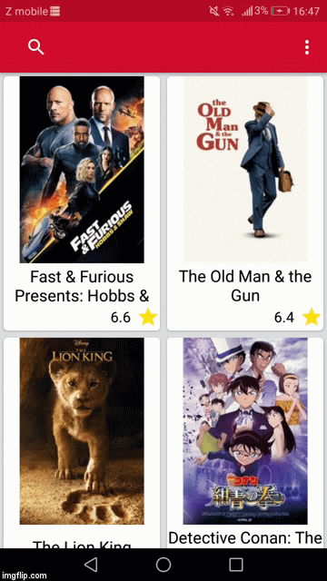
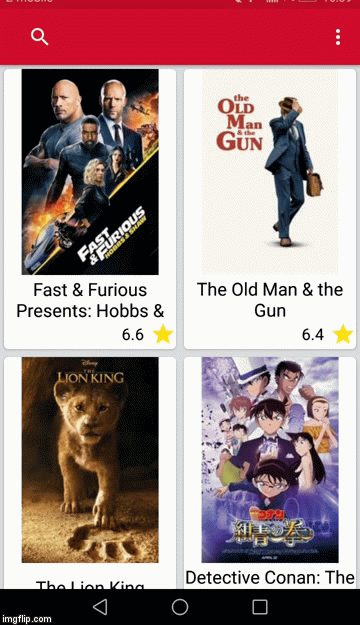
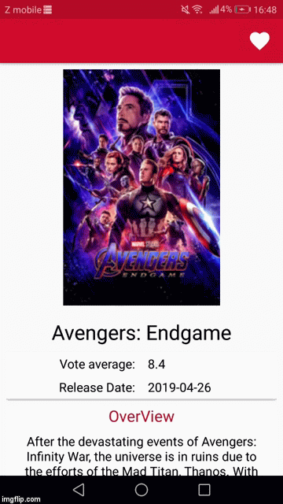
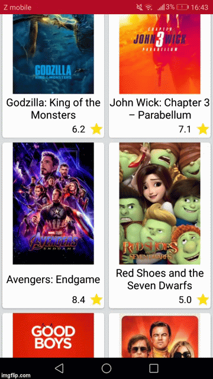

# Popular Movies, Stage 2

## This app will:

•	Present the user with a grid arrangement of movie posters upon launch. 
•	Allow your user to change sort order via menu: 
•	The sort order can be by most popular or by highest-rated 
•	Allow the user to tap on a movie poster and transition to a details screen with additional information such as: 
•	original title 
•	movie poster image thumbnail 
•	A plot synopsis (called overview in the api) 
•	user rating (called vote_average in the api) 
•	release date 
•	Allow users to view and play trailers (either in the youtube app or a web browser). 
•	Allow users to read reviews of a selected movie. 
•	Allow users to mark a movie as a favorite in the details view by tapping a button (heart).

## Libraries 

•	Android Architecture Components (Room, ViewModel, LiveData)  
•	Retrofit  
•	Glide  
•	Gson 

## API Key 

 You have to enter your own API key into gradle.properties file. 
 API_KEY = "your-api-key"
 
 ## Gifs
 

&nbsp&nbsp&nbsp&nbsp&nbsp&nbsp&nbsp&nbsp&nbsp&nbsp&nbsp&nbsp&nbsp&nbsp&nbsp&nbsp&nbsp&nbsp&nbsp&nbsp;

 

  
  
 
 

&nbsp&nbsp&nbsp&nbsp&nbsp&nbsp&nbsp&nbsp&nbsp&nbsp&nbsp&nbsp&nbsp&nbsp&nbsp&nbsp&nbsp&nbsp&nbsp&nbsp;

 

